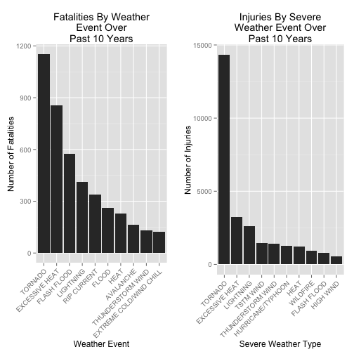
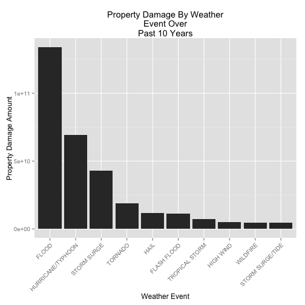

## Impact of Severe Weather Events in the United States: Population Health and Economic Impact

### Synopsis
This report will focus on analyzing the impact of severe weather events within the United States to determine which types of events have the greatest impact to both Population Health and the Economy.  The analysis will be conducted using National Weather Service's [Storm Data](https://d396qusza40orc.cloudfront.net/repdata%2Fdata%2FStormData.csv.bz2) set.

In order to make a determination on the impact to Population Health, the report will look at Fatality and Injury counts associated to the various severe weather events.  In respect to Economic impact, the report will look at Property Damage and Crop Damage data associated to the various sever weather events.

The analysis within this report will examine the dataset at a macro level looking at combined data across the United States as a whole.  The examination will be based on a subset of the overall dataset.  The subset will be the data relevant to 2001 - 2011 as this data is the most robust data available within the dataset.

### Preliminary Settings

To begin, the necessary global settings and libraries must be loaded.


```r
echo = TRUE  # Ensure that Knitr will echo code chunks
options(scipen = 1)  # Disable Scientific Notation
library(dplyr)
library(ggplot2)
require(gridExtra)
```

### Data Processing - Population Health

The first step in the analysis is to obtain the Storm Data dataset and read the data into memory. NOTE: Please be patient, the Storm Data file is large and will take a bit to load.


```r
## determine if the desired file already exists in the working directory
if (!file.exists("./StormData.csv.bz2")) {
        ## if not, download the file
        fileURL <- "https://d396qusza40orc.cloudfront.net/repdata%2Fdata%2FStormData.csv.bz2"
        download.file(fileURL,destfile="./StormData.csv.bz2",method="curl")
}

## read the file into memory
stormData <- read.csv(bzfile('./StormData.csv.bz2'))
```

After loading the dataset, we append a new "YEAR" variable to the dataset.  The "YEAR" variable will work off of the BGN_DATE associated to each severe weather event record and extract the year portion of the date.  The "YEAR" variable will allow for easy grouping and sorting later in the analysis.


```r
stormData$YEAR <- as.numeric(format(as.Date(stormData$BGN_DATE, format = "%m/%d/%Y %H:%M:%S"), "%Y"))
```

After appending the YEAR variable, an examination of the dataset via a histogram reveals that the most robust part of the dataset occurs in the late 90's through 2011 (the final year of available data). 


```r
hist(stormData$YEAR,breaks=50)
```

 

Given this information, we will use the last available 10 years of data as a representative sample for the dataset.  Therefore, we will use 2001 through 2011 as the basis of the analysis.

Before proceeding further, we'll examine the available variables in the Storm Data dataset to determine what variables we will carry forward throughout the remainder of the report.

```r
names(stormData)
```

```
##  [1] "STATE__"    "BGN_DATE"   "BGN_TIME"   "TIME_ZONE"  "COUNTY"    
##  [6] "COUNTYNAME" "STATE"      "EVTYPE"     "BGN_RANGE"  "BGN_AZI"   
## [11] "BGN_LOCATI" "END_DATE"   "END_TIME"   "COUNTY_END" "COUNTYENDN"
## [16] "END_RANGE"  "END_AZI"    "END_LOCATI" "LENGTH"     "WIDTH"     
## [21] "F"          "MAG"        "FATALITIES" "INJURIES"   "PROPDMG"   
## [26] "PROPDMGEXP" "CROPDMG"    "CROPDMGEXP" "WFO"        "STATEOFFIC"
## [31] "ZONENAMES"  "LATITUDE"   "LONGITUDE"  "LATITUDE_E" "LONGITUDE_"
## [36] "REMARKS"    "REFNUM"     "YEAR"
```

After reviewing the names data, we will subset the Storm Data dataset to those records dated 2001 - 2011.  We will also subset the columns to reduce the data set size.

```r
## subset the last 10 years of storm data
stormLast10 <- subset(stormData,
                      stormData$YEAR >= 2001 & stormData$YEAR <= 2011,
                      select=c("STATE","EVTYPE","FATALITIES","INJURIES","PROPDMG",
                               "PROPDMGEXP","CROPDMG","CROPDMGEXP","YEAR"))

## free up memory after subsetting
rm(stormData)
```

Now, with our subsetted dataset we can conduct analysis on Fatalities and Injuries by summarizing Fatality and Injury data by type.  We do this by summarizing Fatality data by Event Type and Injury data by Event type.  These items are stored in data frames called FatalityByType and InjuryByType, respectively.  These summarized sets are further reduced to Top10Fatalities and Top10Injuries.

```r
## summarize fatality data by EVTYPE
FatalityByType <- summarise(group_by(stormLast10,EVTYPE),FATALITIES = sum(FATALITIES))
## remove all rows where no Fatality data exists.
FatalityByType <- FatalityByType[FatalityByType$FATALITIES > 0, ]
## arrange Fatality data in descending order
FatalityByType <- arrange(FatalityByType,desc(FATALITIES))
## subset the FatalityByType data to include the top 10 most impactful events.
Top10Fatalities <- head(FatalityByType,10)

##repeat the process for Injuries
InjuryByType <- summarise(group_by(stormLast10,EVTYPE),INJURIES = sum(INJURIES))
InjuryByType <- InjuryByType[InjuryByType$INJURIES > 0, ]
InjuryByType <- arrange(InjuryByType,desc(INJURIES))
Top10Injuries <- head(InjuryByType,10)
```

After summarizing our data, it is necessary to re-level the factors  for the subsetted and summarized data.  This re-leveling will place the summarized and grouped data into descending order where the most Fatality causing and Injury casuing Severe Weather Events are ranked higher than the lesser impacting events.

```r
## adjust Factors based on reduced dataset
## cast as Character to remove existing Factor Levels
Top10Fatalities$EVTYPE <- as.character(Top10Fatalities$EVTYPE)
## recast as Factor to add back applicable Factor Levels
Top10Fatalities$EVTYPE <- as.factor(Top10Fatalities$EVTYPE)
## reorder the Factor Levels based on the Fatality Numbers associated to the level
Top10Fatalities$EVTYPE <- reorder(Top10Fatalities$EVTYPE,Top10Fatalities$FATALITIES)
## reverse the order to be descending
Top10Fatalities$EVTYPE <- factor(Top10Fatalities$EVTYPE, levels=rev(levels(Top10Fatalities$EVTYPE)))

## repeat for Injuries
## cast as Character to remove existing Factor Levels
Top10Injuries$EVTYPE <- as.character(Top10Injuries$EVTYPE)
## recast as Factor to add back applicable Factor Levels
Top10Injuries$EVTYPE <- as.factor(Top10Injuries$EVTYPE)
## reorder the Factor Levels based on the Fatality Numbers associated to the level
Top10Injuries$EVTYPE <- reorder(Top10Injuries$EVTYPE,Top10Injuries$INJURIES)
## reverse the order to be descending
Top10Injuries$EVTYPE <- factor(Top10Injuries$EVTYPE, levels=rev(levels(Top10Injuries$EVTYPE)))
```

### Results - Population Health

Now, with our Population Health data subsetted, grouped, and summarized we can examine which Severe Weather Events have the greatest impact to the United States at a macro level.  We do this by creating bar plots using GGPLOT2.


```r
## create the fatality plot
FatalityLast10 <- qplot(Top10Fatalities$EVTYPE,Top10Fatalities$FATALITIES,geom="bar",stat="identity") + theme(axis.text.x = element_text(angle = 45, hjust = 1)) + xlab("Weather Event") + scale_y_continuous("Number of Fatalities") + ggtitle("Fatalities By Weather\nEvent Over\nPast 10 Years")

## create the injury plot
InjuryLast10 <- qplot(Top10Injuries$EVTYPE,Top10Injuries$INJURIES,geom="bar",stat="identity")  + theme(axis.text.x = element_text(angle = 45, hjust = 1))  + xlab("Severe Weather Type") + scale_y_continuous("Number of Injuries") + ggtitle("Injuries By Severe\nWeather Event Over\nPast 10 Years")

## combine the plots into a single multi-panel image
grid.arrange(FatalityLast10,InjuryLast10,ncol=2)
```

 

Based on the above plots, it becomes clear that the Severe Weather Events that are most impactful to Population Health in the United States are **Tornados**.  Tornados are responsible for substantially more fatalities and injuries than any other Severe Weather Event.

### Data Processing - Property Damage

The first step in processing the data for Property Damage is to convert the PROPDMGEXP factor to a numeric value.


```r
## convert PROPDMGEXP to a character variable
stormLast10$PROPDMGEXP <- as.character(stormLast10$PROPDMGEXP)

## create a data frame to merge PROPDMGEXP in order to get the numeric impact multiplier
multiplierDF <- data.frame(c("K","M","B",""),c(1000,1000000,1000000000,1))
colnames(multiplierDF) <- c("Factor","PropMult")
```

Once we've merged in the multiplier, we can apply it as a conversion factor to the existing PROPDMG column.


```r
## merge stormLast10 with multiplierDF
stormLast10 <- merge(stormLast10,multiplierDF,by.x="PROPDMGEXP",by.y="Factor")

## create the total property damage column
stormLast10$TotalPropDmg <- stormLast10$PropMult * stormLast10$PROPDMG
```

Now, we can summarize the dataset by Property Damage as it relates to each specific Severe Weather Event, filter out events that didn't cause any damage, order the events by most damaging, and ultimately create our Top10PropertyDmg data frame.

```r
## summarize Property Damage by Event Type
PropertyDmgByType <- summarise(group_by(stormLast10,EVTYPE),PROPDMG = sum(TotalPropDmg))
## remove all rows where no property damage data exists.
PropertyDmgByType <- PropertyDmgByType[PropertyDmgByType$PROPDMG > 0, ]
## arrange Fatality data in descending order
PropertyDmgByType <- arrange(PropertyDmgByType,desc(PROPDMG))
## subset the FatalityByType data to include the top 10 most impactful events.
Top10PropertyDmg <- head(PropertyDmgByType,10)
```

Then, we can adjust the factor levels (as we did with Fatalities and Injuries) to order the data in the desired descending format.

```r
## cast as Character to remove existing Factor Levels
Top10PropertyDmg$EVTYPE <- as.character(Top10PropertyDmg$EVTYPE)
## recast as Factor to add back applicable Factor Levels
Top10PropertyDmg$EVTYPE <- as.factor(Top10PropertyDmg$EVTYPE)
## reorder the Factor Levels based on the Fatality Numbers associated to the level
Top10PropertyDmg$EVTYPE <- reorder(Top10PropertyDmg$EVTYPE,Top10PropertyDmg$PROPDMG)
## reverse the order to be descending
Top10PropertyDmg$EVTYPE <- factor(Top10PropertyDmg$EVTYPE, levels=rev(levels(Top10PropertyDmg$EVTYPE)))
```

### Results - Economic Impact

Now, with our cleaned, grouped, and summarized Property Damage data we can plot the results to determine what Severe Weather Events have the greatest Economic Impact.

```r
## create the property damage plot
PropertyLast10 <- qplot(Top10PropertyDmg$EVTYPE,Top10PropertyDmg$PROPDMG,geom="bar",stat="identity") + theme(axis.text.x = element_text(angle = 45, hjust = 1)) + xlab("Weather Event") + scale_y_continuous("Property Damage Amount") + ggtitle("Property Damage By Weather\nEvent Over\nPast 10 Years")

## print the plot
print(PropertyLast10)
```

 

As we can see from the above plot, **Flooding** and **Hurricanes/Typhoons** are the two Severe Weather Events with the most impact on Economic Activity.

### Conclusion

Through our analysis, we can see that **Tornados** are the Severe Weather Event with the most significant impact on Population Health in terms of Fatalities and Injuries while **Flooding** is responsible for the largest Economic impact in terms of Property Damage.
